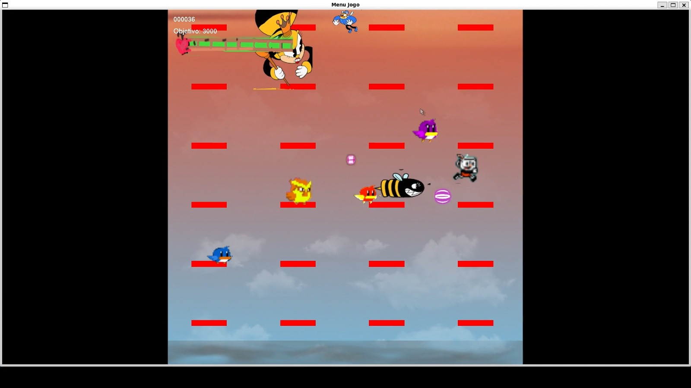

<h1 align="center">
    <p>Cuphead Game - Readme</p>
    
    <p>Desafie os limites e prepare-se para mergulhar em um universo épico de desafios e conquistas!</p>
</h1>

## 📚 Visão Geral

O projeto do jogo Cuphead, desenvolvido na linguagem de programação C, é uma implementação simplificada do famoso jogo de plataforma e tiro Cuphead. O jogo consiste em controlar o personagem principal, Cuphead, através de 3 níveis desafiadores, derrotando inimigos e chefe até alcançar o paraído.

Tal projeto é um trabalho que foi desenvolvido para a disicplina de Computação Gráfica a pedido do professor André do Centro Federal de Educação Tecnológica de Minas Gerais.
    
## 🎮 Preview do jogo

<p align="center">
    Clique na imagem abaixo e assista um pequeno vídeo mostrando o jogo
    <a href="https://www.youtube.com/watch?v=ffKkPrkV4sM">
        
    </a>
</p>

## 🛑 Requisitos do Sistema

Para executar o jogo Cuphead, certifique-se de ter os seguintes requisitos:

1. Um computador com sistema operacional Windows, Linux ou macOS.
2. Compilador C compatível com o padrão C99.
3. Bibliotecas gráficas instaladas (como o OpenGL)

## 🖥️Instalação

Siga as etapas abaixo para instalar e executar o jogo:

1. Clone ou faça o download do repositório do projeto.

2. Certifique-se de ter instalado o compilador C e as bibliotecas gráficas necessárias no seu sistema.

3. Navegue até o diretório do projeto no terminal.

4. Compile e execute o código-fonte do jogo pelo pelo terminal, abrindo-o na pasta do projeto e digite o seguinte comando:

    ```
    make run
    ```
    Existe um arquivo Makefile disponível na pasta do projeto, o qual foi criado para facilitar a compilação e execução do programa, independentemente do sistema operacional utilizado.

## ⌨️ Uso

Ao iniciar o jogo Cuphead, você será apresentado ao menu principal, onde poderá selecionar as opções disponíveis, como iniciar um novo jogo ou visualizar suas instruções.

Após iniciar um novo jogo, você será levado para o primeiro nível do jogo, onde deverá controlar o personagem Cuphead e enfrentar inimigos. Use as teclas w, a, s e d para mover o personagem para cima, para esquerda, para baixo, e para direita, respectivamente, o mouse para atirar.

O objetivo é progredir por todos os níveis, derrotar os inimigos e o chefe da última fase. Ao longo do caminho, você ganhará pontos permanecendo vivo e matando os inimigos da fase em questão, cada fase tem 3 minutos de duração e para passar para fase seguinte você deve sobreviver durante esse período de tempo.

## 💡 Contribuição

Este projeto foi desenvolvido como parte de um trabalho da faculdade e, portanto, não está aberto a contribuições externas no momento.

## 🫂 Agradecimentos

Gostaríamos de expressar nossos agradecimentos a todas as pessoas envolvidas no desenvolvimento deste projeto.
Agradecemos aos membros da equipe, abaixo listados, que contribuíram com seu tempo, esforço e ideias para tornar este projeto uma realidade.

- Aira Winner Sousa Ramos Torres
- Eduardo Morais Silva Martins
- Gabriel Araujo Barbosa
- Luan Marcelino de Souza
- Milena Bueno Maciel

Também gostaríamos de estender nossos agradecimentos ao professor André de Computação Gráfica que forneceu orientação e suporte ao longo do desenvolvimento do jogo Cuphead em C.

## 🖇️ Informações Adicionais

Para obter mais informações sobre o jogo Cuphead original, visite o site oficial do desenvolvedor: cupheadgame.com

Este projeto é apenas uma implementação simplificada e não está associado ou endossado pelos desenvolvedores originais do Cuphead.
